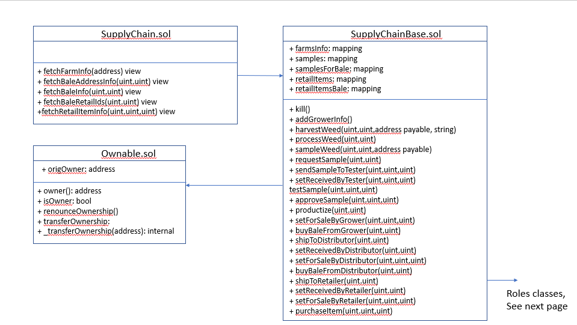
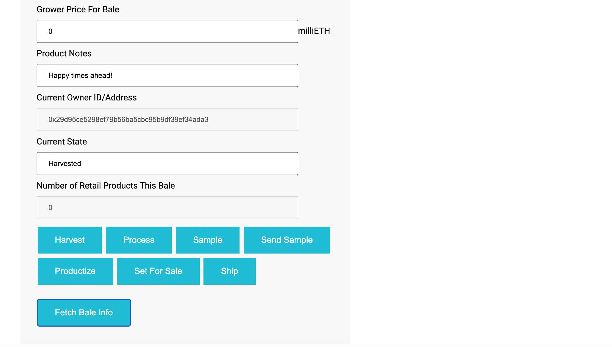

# Cannabis Supply Chain

This repo contains an Ethereum DAPP that demonstrates the usage of an Ethereum-based smart contract
supply chain for the legal cannabis industry.  

The players in this industry are:

- Grower: This is the cannabis farmer
- Tester: This is a quality testing organization that contracts with the Grower to verify the quality
of the cannabis and to identify it's features, such as THC and CBD content
- Distributor: This is a middleman organization between Grower and Retailer. The Distributor buys in bulk
from the Grower and sell at a markup to Retailers.
- Retailer: This is the dispensary where cannabis is sold to Customers in small quantities, usually in 
1/8 ounce (3.5 gram) containers.
- Consumer: This is the person who buys the cannabis. (Contrary to stereotypes, only some of these people
are stoners or middle aged hippies - many are retirees, soccer moms, or other regular people).

This DAPP demonstrates how any cannabis product can be tracked through the supply chain (from Grower 
through Tester to Distributor to Retailer to Consumer) to ensure that each player is getting exactly 
what they paid for.

There are 4 possible cannabis strains that can be sold, and the least significant digit 
(rightmost digit) UPC is used to determine which strain is being sold. This is detemined
as follows:

Digit: 0,1,2 => Strain = Trippy Purple Bubblegum Haze (a sativa)

Digit: 3,4,5 => Strain = Vulcan Mind Melt (a hybrid) 

Digit: 6,7 => Strain = Catatonic Couchlock Kush (an indica)

Digit: 8,9 => Strain = Snoozy Woozy (a high CBD, low THC strain)

# DISCLAIMER 

This software is meant for demonstration purposes only. There is no actual cannabis for sale
in this app! I wrote this software while residing in the state of California, where cannabis is legal. 
Cannabis remains illegal in most of the rest of the world. Commercial usage (anything involving the sale or
distrubution of real cannabis) of this software in any area of the world where cannabis is illegal is 
strictly forbidden. Again, this software is for demonstration purposes only!

See also the [license](license.md) who participated in this project.

# Rinkeby Deployment

This SupplyChain.sol contract has been deployed successfully on the Rinkeby test network. The contract address is:

0x6C8bDdF9C87b59Dc640841b754f8642AB126C6FA

The Transaction hash is: 

0xf07c702c585a0ba4d8e7bb1f5e41af1f540b1c11aed5f71deef778b1f50ae953

# Project UML Diagrams

### Activity Diagram


### Sequence Diagram


### State Diagram


### Class Diagram (Data Model)



# Libraries
The only library I used was Roles.sol which was the parent class of all the Roles contracts. This was provided in the sample code.

# DAPP Overview 

The DAPP consists of these components:
- Documentation. That includes this README file plus UML diagrams contains in the docs folder.
- Contracts: This code (in app/contracts) contains the contract for the supply chain as well as parent
contracts for various roles and ownability.
- Tests: This code (in test folder) contains unit tests for the contract functions
- User Interface: This code (in index.html and in src/js/*.js) is a demonstration user interface in 
HTML and Javascript that is used to show the functionality of the supply chain code.

# Prerequisites

To run this code you will need the following installed

- Node
- Truffle 0.5
- Metamask
- An account on Infura and a created Infura project
- Note: I did not use IPFS in this project

# Installation and Setup

To install, git clone this repo onto your machine. Then CD into the app subfolder. Next execute these 
commands in sequence:

1. npm install 
2. Get the 12 word mnemonic from your Metamask wallet. I strongly recommend you do NOT use your
actual live wallet - instead just create a new wallet that you only intend to use for testing on
local blockchains or test networks like Rinkeby. Copy that mnemonic into a file called .secret that
you create inside the app folder. You should set the network of this wallet to Rinkeby and
use the Rinkeby faucet to get some fake Ether.
3. Create a file .infuraKey  in the app folder. If you only wish to test locally, you do
not need to put anything inside this file (or it can be garbage text), but if you
plan on deploying your own version of this code to Rinkeby, you will need to put in the project ID
of an infura project you own
4. truffle develop
5. Once you get the prompt for the development invironment, do this: compile
6. test
7. migrate --reset
This set of steps launches a private local blockchain inside Truffle and deploys the smart contract code
on that blockchain.

With the smart contracts running locally, you now have a fake local blockchain with 10 accounts. 
Before you can test locally, you must import 6 of these accounts into Metamask. To do that, go the list 
of accounts that gets shown when you first run truffle develop. Your Metamask will already have Account 1,
which is your test Rinkeby account. In Metamask you will need to create a Custom RPC network for the
local accounst you are about to import. This local network run on http://127.0.0.1:9545 and has a 
network ID of 1337. (On my machine I called this network "Truffle Dev Network").

To Import the accounts from Truffle, copy the first 6 private keys (one by one) and create a new 
Account inside Metamask for each of these. If your Metamask Account 1 is your Rinkeby test account, then 
Account 2 in Metamask will be the account with index 0 in Truffle, Account 3 in Metamask will be
the account with index 1 in Truffle, etc. (I wish Metamask it easier to rename accounts).

# Running the User Interface

You can now run the UI and test things out. To do that, open another command window and run this: 

npm run dev 

That command runs the UI locally on localhost at port 3000 (http://127.0.0.1:3000).

The interface has 8 sections in one big long webpage (again, this is a demo UI, not meant for
commercial deployment!) The sections are as follows:

1. Ethereum Addresses. This is where we enter the Ethereum addresses for all players. In the real world 
there will be multiple Growers, Testers, etc, but here we use only one player for each role.
2. Grower UI/Farm Information. This is where the Grower will specify some basic information about his farm
3. Grower UI/Bale Information. The wholesale/harvested quantify of cannabis is what I call a "bale". Imagine a bale
of hay but where all the hay is cannabis instead. Note: I have no idea what the actual wholesale
quantity of cannabis is, I just picked a term that seems reasonable.
4. Tester UI. This is where the Tester can request samples and can move the sample through testing and 
approval. 
5. Distributor UI. This is where the Distributor can buy cannabis from the Grower, can productize it
(into some number of 3.5 gram jars) and can sell this to the Retailer. NOTE: in this code we specify
that each bale can be productized into exactly 10 jars of cannabis. This number is quite a bit lower
than what would be possible in reality, but it adequately demonstrates the process.
6. Retailer  UI. This is where the Retailer can offer the cannabis for sale to Consumers.
7. Consumer UI. This is where the Consumer can purchase individual retail items (3.5 gram jars) of cannabis.
8. Events: This is a list of the events emitted by the smart contracts to show and verify the
movement of the items through the supply chain.

The DApp User Interface when running should look like...





# Walking Through the UI

To test this app locally you will need to do the following steps in order. Note that Metamask is quite fiddly
so you will often need to reset your Metamask account when switching to it the first time. In the following
I will idicate where account resets are important.

1. Assuming you launched the interface using "npm run dev", you will see a brower window open with the UI.
I also assume you have imported the first 6 accounts from Truffle, and your Metamask is now set to 
Account 2 (the 0th account in Truffle) and is on your local test network (eg Truffle Dev Network) 
running on port 9545.
2. Reset the current account (Account 2) in Metamask. 
3. Go to the command window where "truffle develop" is running and copy the Account ID (NOT the private key!)
for truffle account [1] into the input for Grower in the Addresses section of the UI (the top section). 
Press the Add Grower button.
4. Go to the command window where "truffle develop" is running and copy the Account ID (NOT the private key!)
for truffle account [2] into the input for Tester in the Addresses section of the UI (the top section). 
Press the Add Tester button.
5. Go to the command window where "truffle develop" is running and copy the Account ID (NOT the private key!)
for truffle account [3] into the input for Distributor in the Addresses section of the UI (the top section). 
Press the Add Distributor button.
6. Go to the command window where "truffle develop" is running and copy the Account ID (NOT the private key!)
for truffle account [4] into the input for Retailer in the Addresses section of the UI (the top section). 
Press the Add Retailer button.
7. Go to the command window where "truffle develop" is running and copy the Account ID (NOT the private key!)
for truffle account [5] into the input for Consumer in the Addresses section of the UI (the top section). 
Press the Add Consumer button.
8. Now switch accounts in Metamask to the Grower account (Account 3 in Metamask = truffle account [1]). Reset that account in Metamask.
9. Enter the farm information in various fields in the Grower Interface section. Press the Add Grower Info button. 
If you get an error, you may have to press it again, or you may have to reset the account.
10. Now go to the Product Overview section and create a new bale. A bale is uniquely identified by its UPC and
baleId. The SKU is computed internally automatically. At this stage all you need to enter is UPC, baleId,
and productNotes. Press the Harvest button to create a new bale and harvest it. Press the Fetch Bale Info button to see the changes.
12. Press the Process button to process. Press the Fetch Bale Info button to see the changes.
13. Press the Sample button to process. Press the Fetch Bale Info button to see the changes.
14. Switch accounts to the Tester account (Account 4 in Metamask, account [2] in Truffle). Reset the
account in Metamask. You are now the tester.
15.Press the Request Sample button to request the sample. Press the Fetch Bale Info button to see the changes.
16. Switch accounts back to the Grower account (Account 3 in Metamask). You are now the grower. Do NOT reset the account (you
only have to do this the first time you switch to the account in any given run through the supply chain).
Press the Send Sample button. Press the Fetch Bale Info button to see the changes.
17. Switch accounts back to the Tester account (Account 4 in Metamask). You are now the tester again. Do NOT reset the account (you
only have to do this the first time you switch to the account in any given run through the supply chain).
Press the Receive Sample button. Press the Fetch Bale Info button to see the changes.
18. Press the Test Sample button to start testing. Press the Fetch Bale Info button to see the changes.
19. Press the Approve button to approve the sample. Press the Fetch Bale Info button to see the changes. 
Note that the THC and CBD content of the bale are now specified.
20. Switch accounts back to the Grower account (Account 3 in Metamask). You are now the grower. Do NOT reset the account (you
only have to do this the first time you switch to the account in any given run through the supply chain).
Press the Productize button to productize. Press the Fetch Bale Info button to see the changes.
21. Enter a grower price (in milliEther) for the bale. (I suggest using 40). Press the Set For Sale button to set the bale as for sale.
Press the Fetch Bale Info button to see the changes.
22. Switch accounts to the Distributor account (Account 5 in Metamask, account [3] in Truffle). Reset the
account in Metamask. You are now the distributor. Press Buy to buy the bale from the grower. 
Press the Fetch Bale Info button to see the changes.
23. Switch accounts back to the Grower account (Account 3 in Metamask). You are now the grower. Do NOT reset the account (you
only have to do this the first time you switch to the account in any given run through the supply chain).
Press the Ship button to ship the bale to the distributor. Press the Fetch Bale Info button to see the changes.
24. Switch accounts back to the Distributor account (Account 5 in Metamask). You are now the distributor. Do NOT reset the account (you
only have to do this the first time you switch to the account in any given run through the supply chain).
Press the Receive Bale button to indicate that the distributor received the bale. Press the Fetch Bale Info button to see the changes.
25. In the Distributor Interface, enter a distributor price (in milliEther) for the bale. (I suggest using 80). 
Go to the Distributor Interface and press the For Sale button to set the bale as for sale. Press the Fetch Bale Info button to see the changes.
26. Switch accounts to the Retailer account (Account 6 in Metamask, account [4] in Truffle). Reset the
account in Metamask. You are now the retailer. Go to the Retailer Interface and press Buy to buy the bale from the distributor.
Press the Fetch Bale Info button to see the changes.
27. Switch accounts back to the Distributor account (Account 5 in Metamask). You are now the distributor. Do NOT reset the account (you
only have to do this the first time you switch to the account in any given run through the supply chain).
In the Distributor Interface, press the Ship button to ship the bale (in the form of its 10 retail products) to the retailer. 
Press the Fetch Bale Info button to see the changes.
28. Switch accounts back to the Retailer account (Account 5 in Metamask). You are now the retailer. Do NOT reset the account (you
only have to do this the first time you switch to the account in any given run through the supply chain).
In the Retailer Interface, press the Set Received button to indicate that the retailer received the bale. Press the Fetch Bale Info button to see the changes.
29. Enter a retailer price (in milliEther) for each retail item. (I suggest using 16 because 10*16 = 160 which is 100% markup from the
distributor price of 80). 
Press the For Sale button to set the retail item states for sale. Press the Fetch Bale Info button to see the changes.
30. Switch accounts to the Consumer account (Account 7 in Metamask, account [5] in Truffle). Reset the
account in Metamask. You are now the consumer. Press any of the 10 Purchase buttons to buy  a retail jar of cannabis from the 
retailer. Press the Fetch Bale Info button to see the changes.
31. Note that the above steps result in a sequence of events being fired off frm the supply chain smart contract. These events
are shown in the events window at the bottom of the UI.


# *************** Original Readme Below *******************

# Supply chain & data auditing

This repository containts an Ethereum DApp that demonstrates a Supply Chain flow between a Seller and Buyer. The user story is similar to any commonly used supply chain process. A Seller can add items to the inventory system stored in the blockchain. A Buyer can purchase such items from the inventory system. Additionally a Seller can mark an item as Shipped, and similarly a Buyer can mark an item as Received.


## Getting Started

These instructions will get you a copy of the project up and running on your local machine for development and testing purposes. See deployment for notes on how to deploy the project on a live system.

### Prerequisites

Please make sure you've already installed ganache-cli, Truffle and enabled MetaMask extension in your browser.

```
Give examples (to be clarified)
```

### Installing

> The starter code is written for **Solidity v0.4.24**. At the time of writing, the current Truffle v5 comes with Solidity v0.5 that requires function *mutability* and *visibility* to be specified (please refer to Solidity [documentation](https://docs.soliditylang.org/en/v0.5.0/050-breaking-changes.html) for more details). To use this starter code, please run `npm i -g truffle@4.1.14` to install Truffle v4 with Solidity v0.4.24. 

A step by step series of examples that tell you have to get a development env running

Clone this repository:

```
git clone https://github.com/udacity/nd1309/tree/master/course-5/project-6
```

Change directory to ```project-6``` folder and install all requisite npm packages (as listed in ```package.json```):

```
cd project-6
npm install
```

Launch Ganache:

```
ganache-cli -m "spirit supply whale amount human item harsh scare congress discover talent hamster"
```

Your terminal should look something like this:


In a separate terminal window, Compile smart contracts:

```
truffle compile
```

Your terminal should look something like this:


This will create the smart contract artifacts in folder ```build\contracts```.

Migrate smart contracts to the locally running blockchain, ganache-cli:

```
truffle migrate
```

Your terminal should look something like this:


Test smart contracts:

```
truffle test
```

All 10 tests should pass.


In a separate terminal window, launch the DApp:

```
npm run dev
```

## Built With

* [Ethereum](https://www.ethereum.org/) - Ethereum is a decentralized platform that runs smart contracts
* [IPFS](https://ipfs.io/) - IPFS is the Distributed Web | A peer-to-peer hypermedia protocol
to make the web faster, safer, and more open.
* [Truffle Framework](http://truffleframework.com/) - Truffle is the most popular development framework for Ethereum with a mission to make your life a whole lot easier.


## Authors

See also the list of [contributors](contributors.md) who participated in this project.

## Acknowledgments

* Solidity
* Ganache-cli
* Truffle
* IPFS
